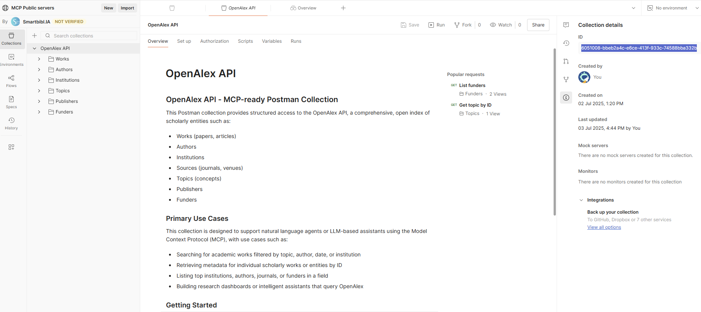
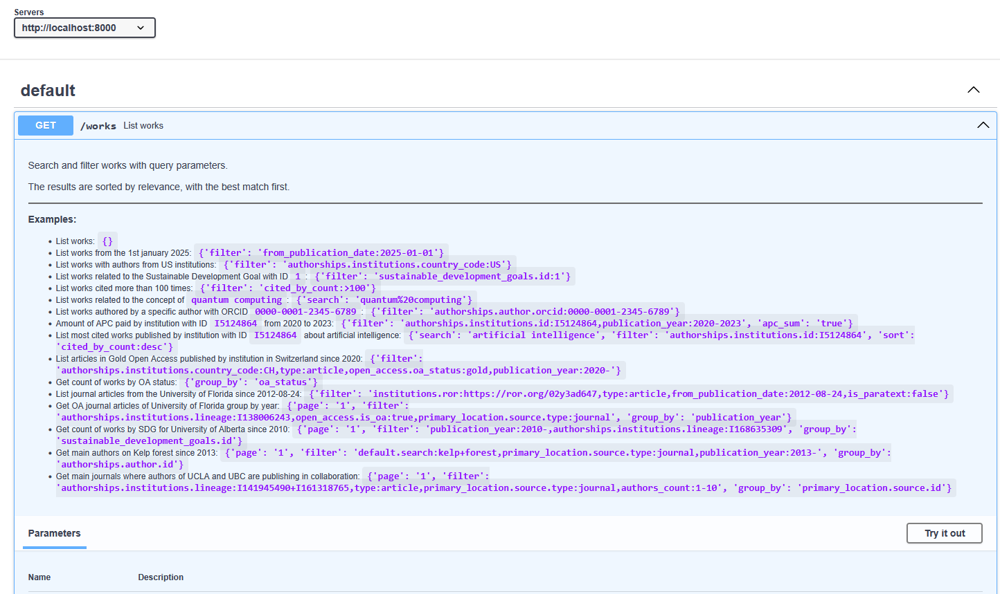

# OpenAlex postman2mcp

A working application application of the [postman2mcp](https://github.com/gegedenice/postman2mcp) module

## Running with Docker

This repository is dockerized for easy setup and deployment. The two services (FastAPI and FastMCP) are managed using `docker-compose`.

### Prerequisites

- [Docker](https://docs.docker.com/get-docker/)
- [Docker Compose](https://docs.docker.com/compose/install/)

### Usage

1. **Build and start the services:**

   ```bash
   docker-compose up --build
   ```

   This command will build the Docker image for the services and start them. The `-d` flag can be used to run the services in detached mode.

2. **Access the services:**

   - **FastAPI server:** `http://localhost:8000`
   - **FastMCP server:** `http://localhost:3333/mcp`

3. **Stopping the services:**

   To stop the services, press `Ctrl+C` in the terminal where `docker-compose` is running, or run the following command from the project root:

   ```bash
   docker-compose down
   ```

---

## How was the project generated

1. OpenAlex Postman source collection


[https://www.postman.com/smartbiblia/mcp-public-servers/collection/dfbn6uv/openalex-api](https://www.postman.com/smartbiblia/mcp-public-servers/collection/dfbn6uv/openalex-api)

2. Retrieve the collection uid

- By the Postman API to list your collections
```
https://api.getpostman.com/collections?apikey={{postman-api-key-here}}
```
- By viewing Info on the right sidebar



3. Install and use postman2mcp module

```
pip install git+https://github.com/gegedenice/postman2mcp.git
postman2mcp --collection-id  6051008-bbeb2a4c-e6ce-413f-933c-74588bba332b \
            --project-dir gen-openalex-postman2mcp \
            --postman-api-key <POSTMAN_API_KEY> \
            --ngrok-authtoken <NGROK_AUTHTOKEN>
```

4. Results

The generated scripts folder + documentation is generated at the current path with the project-dir given name (gen-openalex-postman2mcp)

## Run the FastAPI & FastMCP servers

- Locate in the project dir
```
cd gen-openalex-postman2mcp
python -m venv .venv
   .venv\Scripts\activate  # On Windows
   source .venv/bin/activate  # On Linux/Mac
pip install -r requirements.txt
```
- Follow the README.md instructions

  - Run the FastAPI server:
    ```
    uvicorn fastapi_proxy.main:app --host 0.0.0.0 --port 8000
    ```
      - The FastAPI server will be running at `http://localhost:8000`.
      - Acces the plugin manifest at `http://localhost:8000/.well-known/ai-plugin.json`.
      - Access the OpenAPI specification at `http://localhost:8000/openapi.json`.
      - Access the Swagger API documentation at `http://localhost:8000/docs`.
      
  - Run the FastMCP server:
    ```
    python server.py
    ```
      - The MCP server is running at `http://localhost:3333/mcp` with the http streamable transport mode
      - If FastMCP Inspector is launched, the inpector UI will be running at `http://localhost:6274` (set the given session token in the console in the Configuration section of the UI)

---

## Examples

> Recommanded: create a a separate virtual environment for the example folder.

> Fill the .env file with your OpenAI API key

This folder provides three example scripts to demonstrate different ways to interact with the OpenAlex API using agents and MCP tools:

### 1. smolagents_multi_agents.py
**Purpose:** Demonstrates a multi-agent architecture for querying and analyzing OpenAlex data using smolagents, OpenAI API, and a Gradio web UI.

- Loads your OpenAI API key from the environment.
- Initializes two agents:
  - **openalex_agent:** Fetches data from OpenAlex API tools (via MCP), ensuring valid API calls and never inventing parameters or IDs.
  - **analyst_agent:** Handles user questions, breaks them down into steps, delegates data-fetching to `openalex_agent`, and performs data analysis (using pandas). Always resolves entity names to IDs before querying.
- Provides a Gradio web interface for interactive research questions. The analyst agent interprets the question, plans the steps, fetches and analyzes data, and presents results (including charts if needed).
- **Best for:** Interactive, complex research queries that require both data fetching and analysis, with a clear separation of responsibilities between agents.

### 2. smolagents_simple.py
**Purpose:** Minimal, script-based example showing how to use a single agent to query the OpenAlex API and print the result.

- Loads your OpenAI API key from the environment.
- Initializes a single CodeAgent using the LiteLLMModel (a lightweight LLM interface).
- Connects to the MCP server to access OpenAlex API tools.
- Runs a single, hardcoded query (e.g., paid APC by EPFL in 2024).
- Prints the agent’s response to the console.
- **Best for:** Quick, script-based automation or testing of the agent’s ability to answer a specific question using the OpenAlex API, without any UI or multi-step planning.

### 3. openai_agent.py
**Purpose:** Demonstrates how to set up an async agent using the OpenAI API and MCP tools, with a Gradio UI for user interaction.

- Loads your OpenAI API key from the environment.
- Initializes an async agent (using the `Agent` and `Runner` classes) that can query OpenAlex via MCP.
- Sets up a Gradio web interface for user questions and agent responses.
- Handles agent setup asynchronously and ensures the agent is ready before processing queries.
- **Best for:** Interactive, async research queries with a web UI, using a more direct agent setup (not the smolagents abstraction).

#### Summary Table

| File                      | UI?    | Agents         | Main Features                                      | Best For                        |
|---------------------------|--------|---------------|----------------------------------------------------|---------------------------------|
| smolagents_multi_agents.py| Gradio | 2 (analyst + openalex) | Multi-step planning, data analysis, charts, delegation | Complex, interactive research   |
| smolagents_simple.py      | None   | 1 (code)      | Minimal, script-based, single query, console output | Quick tests, automation         |
| openai_agent.py           | Gradio | 1 (async)     | Async agent, direct OpenAI API, Gradio UI           | Interactive, async research     |

